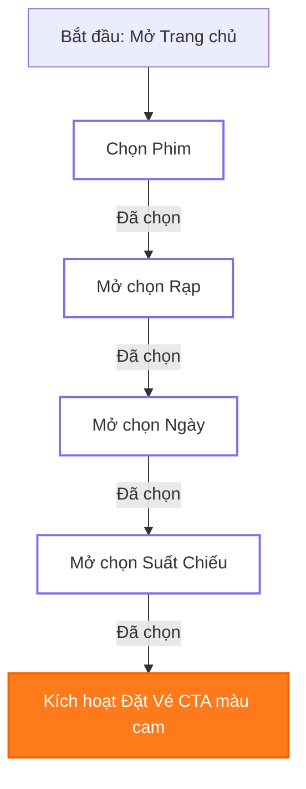

# CINE UX Flow & Interaction Logic

Tài liệu này đặc tả quy trình tương tác người dùng (User Flows), trạng thái dữ liệu và các quy luật trải nghiệm khách hàng (UX Rules) cốt lõi của hệ thống CINE.

---

## 1. Hành trình Người dùng chính (Core User Journeys)

### Hành trình 1: Khách hàng đã xác định bộ phim muốn xem
Khách hàng truy cập trang với mục đích mua vé cụ thể nhanh nhất:
1.  **Trang chủ:** Người dùng nhìn thấy `Quick Booking Panel` nằm ngay đầu trang.
2.  **Chọn Phim:** Người dùng nhấp chọn phim mong muốn trong dropdown thứ nhất.
3.  **Chọn Rạp:** Thả xích trường chọn rạp, người dùng chọn chi nhánh rạp tiện nhất.
4.  **Chọn Ngày:** Dropdown ngày hiển thị các ngày chiếu khả dụng, chọn ngày.
5.  **Chọn Suất Chiếu:** Dropdown cuối cùng mở ra danh mục giờ chiếu phù hợp.
6.  **Nhấn "Đặt Vé Ngay":** Hệ thống tự động chuyển hướng đến trang Chi tiết phim kèm neo suất chiếu được chọn hoặc chuyển tiếp thẳng sang sơ đồ chọn ghế.

### Hành trình 2: Khách hàng lướt duyệt tìm phim (Discovery Flow)
Khách hàng muốn khám phá nội dung trước khi quyết định mua vé:
1.  **Duyệt Phim:** Người dùng lướt xem lưới phim trang chủ hoặc trang danh mục `movies.html`.
2.  **Xem thử Trailer:** Di chuột vào poster phim → Nhấn nút "Trailer" → Cửa sổ nổi (Modal Video) mở lên phát trailer phim ngay lập tức, giữ chân khách hàng ở lại trang.
3.  **Đọc thông tin:** Nhấn vào tiêu đề phim hoặc poster để vào trang `movie-detail.html`.
4.  **Xem lịch và Đặt vé:** Nhấn "Đặt vé ngay" → Cuộn nhanh xuống vùng Lịch chiếu → Nhấp chọn giờ chiếu để tiến hành giữ ghế mua vé.

### Hành trình 3: Khách hàng tìm kiếm qua Thanh điều hướng (Navbar Flow)
1.  Người dùng di chuột qua mục **Phim** trên thanh điều hướng.
2.  Bảng **Mega Dropdown** hiển thị tức thì danh sách 4 phim hot đang chiếu và 4 phim sắp chiếu.
3.  Người dùng có thể:
    *   Click trực tiếp vào poster phim để xem thông tin chi tiết.
    *   Click vào tiêu đề lớn của danh mục (ví dụ `PHIM ĐANG CHIẾU`) để mở trang danh sách đầy đủ `movies.html?category=now-showing`.

---

## 2. Quy trình chọn vé Thác nước (Quick Booking Cascade Flow)

Bảng điều khiển Đặt vé nhanh hoạt động theo mô hình máy trạng thái (state machine) nghiêm ngặt để đảm bảo người dùng không bị nhầm lẫn dữ liệu:

### Các trạng thái của trường nhập liệu (Dropdown Fields):
*   **Placeholder (Chưa chọn):** Hiển thị văn bản hướng dẫn nhạt (ví dụ: "Chọn phim..."). Trường rạp, ngày, giờ kế tiếp bị vô hiệu hóa hoàn toàn.
*   **Active (Đang khả dụng):** Sẵn sàng để nhấp chọn khi bước trước đã được hoàn thành.
*   **Selected (Đã chọn):** Hiển thị rõ giá trị người dùng đã chọn. Đồng thời kích hoạt mở khóa cho trường tiếp theo.
*   **Disabled (Bị khóa):** Trạng thái mờ nhạt (`opacity: 0.45`), trỏ chuột dạng chặn (`cursor: not-allowed`).

---

## 3. Quy luật trạng thái Suất chiếu (Showtime Status Flow)

Mỗi nút giờ chiếu phải truyền tải thông điệp rõ ràng về tình trạng ghế ngồi trong rạp để kích thích quyết định mua hàng:

1.  **Available (Còn vé - Xanh lá):** Suất chiếu bình thường, còn trên 30% tổng số ghế. Hiển thị màu chữ đen, viền xám mỏng.
2.  **Almost Full (Sắp hết vé - Vàng cam):** Suất chiếu còn dưới 10 ghế trống. Hiển thị viền màu vàng cam nhẹ để tạo hiệu ứng tâm lý khẩn trương (scarcity effect).
3.  **Sold Out (Hết vé - Đỏ mờ):** Đã bán hết toàn bộ ghế trong rạp. Nút bấm bị vô hiệu hóa, chữ mờ đỏ nhạt, hiển thị nhãn "Hết vé".
4.  **Past (Đã qua):** Suất chiếu có giờ bắt đầu sớm hơn giờ hiện tại của hệ thống tối thiểu 10 phút. Nút bị ẩn hoặc vô hiệu hóa mờ, không thể nhấp chọn.
5.  **Locked (Tạm khóa):** Suất chiếu bị đóng do rạp đang bảo trì thiết bị hoặc có sự kiện đặc biệt.

---

## 4. Quy tắc trải nghiệm trên thiết bị Di động (Mobile UX Rules)

Để đảm bảo khả năng hiển thị xuất sắc trên màn hình cảm ứng điện thoại di động:
*   **Không phụ thuộc Hover:** Tuyệt đối không thiết kế các tương tác quan trọng chỉ hiển thị khi di chuột (hover). Trên di động, toàn bộ thông tin thẻ phim (như tên, nút đặt vé) phải hiển thị rõ ràng mặc định hoặc hiển thị thông qua cử chỉ chạm (tap).
*   **Thanh cuộn Ngày vuốt ngang (Horizontal Scroll):** Dải chọn ngày chiếu (`Date Slider`) trên điện thoại tự động chuyển đổi thành dải trượt vuốt ngang mượt mà bằng ngón tay (touch swiping).
*   **Dropdown thích ứng di động:** CineDropdown tự động co chiều cao để không bị bàn phím di động che khuất, đồng thời phóng to nhẹ kích thước chữ dòng danh sách lên tối thiểu `15px` để người dùng dễ chạm chọn mà không bị ấn nhầm.
