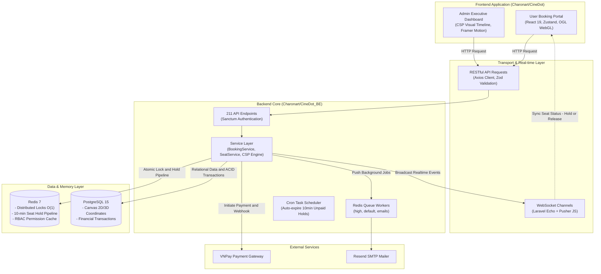

# 🎬 CineDot — Enterprise Cinema Ecosystem & AI Showtime Engine

<p align="center">
  
  
  
  
  
  
  
</p>

> [!IMPORTANT]
> 🔗 **Backend Repository & API Documentation**:  
> Dự án CineDot bao gồm 2 phần tách biệt. Mã nguồn Backend hiệu năng cao (Laravel 10, PostgreSQL 15, Redis Distributed Locks, 211 API endpoints) được lưu trữ tại:  
> 👉 **[Charonart/CineDot_BE](https://github.com/Charonart/CineDot_BE)**

---

## 📌 Table of Contents / Mục Lục

- [Overview / Tổng Quan Dự Án](#-overview--tổng-quan-dự-án)
- [System Architecture / Kiến Trúc Toàn Hệ Thống](#-system-architecture--kiến-trúc-toàn-hệ-thống)
- [Core Engineering Highlights / Điểm Sáng Kỹ Thuật](#-core-engineering-highlights--điểm-sáng-kỹ-thuật)
  - [1. Real-time Concurrency & Distributed Seat Locking](#1--real-time-concurrency--distributed-seat-locking)
  - [2. AI CSP Engine (Automated 24h Showtime Scheduling)](#2--ai-csp-engine-automated-24h-showtime-scheduling)
  - [3. F&B Staggering Guard (Traffic Deconfliction)](#3--fb-staggering-guard-traffic-deconfliction)
  - [4. Interactive 2D/3D WebGL Seat Map](#4--interactive-2d3d-webgl-seat-map)
  - [5. Context-Aware Multi-Tier RBAC](#5--context-aware-multi-tier-rbac)
  - [6. QR E-Ticket & POS Anti-Double-Scan](#6--qr-e-ticket--pos-anti-double-scan)
- [Frontend Features & Routing Map / Tính Năng & Điều Hướng](#-frontend-features--routing-map)
- [Technology Stack / Danh Mục Công Nghệ](#-technology-stack--danh-mục-công-nghệ)
- [Project Directory Structure / Cấu Trúc Thư Mục](#-project-directory-structure--cấu-trúc-thư-mục)
- [Getting Started / Hướng Dẫn Cài Đặt & Khởi Chạy](#-getting-started--hướng-dẫn-cài-đặt--khởi-chạy)
- [Environment Configuration / Cấu Hình Biến Môi Trường](#-environment-configuration--cấu-hình-biến-môi-trường)
- [Demo Credentials / Tài Khoản Trải Nghiệm Mẫu](#-demo-credentials--tài-khoản-trải-nghiệm-mẫu)
- [Author & Contact / Tác Giả](#-author--contact--tác-giả)

---

## 🌟 Overview / Tổng Quan Dự Án

**CineDot** là nền tảng quản lý chuỗi rạp chiếu phim doanh nghiệp (**Enterprise Cinema Management**) và cổng đặt vé trực tuyến cao cấp (**Customer Booking Portal**), giải quyết trọn vẹn cả bài toán **trải nghiệm người dùng (B2C)** lẫn **tối ưu hóa vận hành & tối đa hóa doanh thu rạp chiếu (B2B/Admin POS)**:

1. **User Experience Portal (B2C)**: Trải nghiệm đặt vé mượt mà với sơ đồ ghế 2D/3D tương tác tăng tốc bằng WebGL OGL, đồng bộ trạng thái ghế Realtime qua WebSockets, tích hợp thanh toán trực tuyến VNPay và hệ sinh thái E-Ticket qua email.
2. **Executive Admin & Cinema Operations (B2B/POS)**: Bảng điều hành thông minh với thuật toán xếp lịch chiếu tự động **AI CSP Engine (<30ms)**, cảnh báo chống ùn tắc quầy bắp nước F&B, quản lý giá vé đa tầng, phân quyền theo ngữ cảnh địa lý 3 cấp độ và API soát vé quầy POS chống gian lận.

---

## 🏗️ System Architecture / Kiến Trúc Toàn Hệ Thống

Hệ sinh thái CineDot áp dụng kiến trúc phân tán tách biệt (Decoupled Client-Server) giữa giao diện người dùng Next.js và Backend API Laravel:



---

## ⚡ Core Engineering Highlights / Điểm Sáng Kỹ Thuật

### 1. 🎟️ Real-time Concurrency & Distributed Seat Locking
- **Thách thức**: Hàng nghìn người dùng truy cập đồng thời vào suất chiếu hot và cùng click chọn một vị trí ghế (Race Condition & Overbooking).
- **Giải pháp**:
  - Phía Frontend kết hợp **Optimistic UI Updates** với WebSocket listener qua `Laravel Echo`.
  - Backend sử dụng **Khóa phân tán $O(1)$ trên Redis Pipeline** để giữ ghế tạm thời trong 10 phút (`HOLD_SEAT_EXPIRE_SECONDS = 600`).
  - Khi ghế được giữ hoặc giải phóng, sự kiện `SeatStatusUpdated` lập tức được phát tán qua WebSocket, cập nhật trạng thái ghế trên màn hình của tất cả người dùng khác trong vài mili-giây mà không cần reload trang.

### 2. 🤖 AI CSP Engine (Automated 24h Showtime Scheduling)
- **Thách thức**: Quản lý rạp chiếu phim tốn hàng giờ sắp xếp thủ công lịch chiếu cho nhiều phòng, phải tối ưu giờ vàng (18:00 - 21:30), tính thời gian dọn rạp (Cleaning Buffer 15-20 phút), và ưu tiên phim bom tấn vào phòng chiếu lớn (IMAX Laser).
- **Giải pháp**:
  - Xây dựng thuật toán giải bài toán thỏa mãn ràng buộc **Constraint Satisfaction Problem (CSP)** kết hợp **Greedy Backtracking**.
  - Tốc độ giải thuật vượt trội **< 30ms** cho toàn bộ lịch chiếu 24h từ 08:00 đến 24:00.
  - Hỗ trợ 2 chế độ:
    - `Incremental Fill`: Tự động lấp đầy các khoảng trống rảnh rỗi trong lịch.
    - `Regenerate All`: Xóa và tính toán lại lịch chiếu tối ưu doanh thu nhất.
  - **`🔒 Published Seat Hard Lock`**: Suất chiếu đã có khách mua vé (`bookedSeats > 0`) được tự động khóa cứng, cấm kéo thả dời giờ để bảo vệ quyền lợi người mua.

### 3. 🚦 F&B Staggering Guard (Traffic Deconfliction)
- **Thách thức**: Khi 2 phòng chiếu khởi chiếu cùng giờ (vd: 18:00 & 18:00), lượng khách 350+ người dồn ứ cùng lúc tại quầy vé và quầy bắp nước F&B gây tắc nghẽn nghiêm trọng.
- **Giải pháp**:
  - Giao diện Admin hiển thị thanh kẻ phát sáng (Vertical Drag Alignment Line) với **Tooltip mốc giờ nổi** và tính năng **Nam châm tự động hút (Snap)** vào mốc 15 phút.
  - Tự động kích hoạt cảnh báo thông minh `⚠️ Gợi ý: Lệch 15p F&B` để dời lịch khởi chiếu lệch nhau 15 phút, san phẳng dòng khách.

### 4. 💺 Interactive 2D/3D WebGL Seat Map
- **Công nghệ**: Sử dụng **OGL (Minimal WebGL Library)** kết hợp Canvas 2D/3D.
- **Tính năng**: Sơ đồ ghế động với tọa độ Canvas (`cx`, `cy`), hỗ trợ hiển thị chân thực các định dạng phòng chiếu: Standard, IMAX Laser, 4DX, VIP Gold Class, và Sweetbox Couple. Hiệu ứng chọn ghế mượt mà 60 FPS ngay cả trên thiết bị di động.

### 5. 🛡️ Context-Aware Multi-Tier RBAC
- Phân quyền nhân sự theo 3 cấp độ độc lập: `system` (Super Admin), `region` (Quản lý cụm rạp khu vực), `cinema` (Quản lý rạp cụ thể).
- Bộ nhớ đệm phân quyền Redis siêu tốc (`user:{id}:permissions`), tự động xóa cache tức thời khi Admin thay đổi ma trận quyền.

### 6. 📱 QR E-Ticket & POS Anti-Double-Scan
- Tự động sinh vé điện tử phong cách Cinema Dark & Red (#0B0F19 / #E50914) với mã QR định danh duy nhất gửi qua email.
- API quầy vé POS sử dụng khóa phân tán `lock:checkin:{code}` trên Redis, triệt tiêu hoàn toàn rủi ro 1 vé bị quét vào rạp 2 lần.

---

## 🗺️ Frontend Features & Routing Map

### 🌐 A. Giao Diện Người Dùng (User Portal)

| Đường Dẫn (Route) | Tên Trang | Mô Tả Trải Nghiệm |
| :--- | :--- | :--- |
| `/` | **Trang Chủ (Home)** | Hero banner phim hot, danh sách phim đang chiếu, sắp chiếu, khuyến mãi |
| `/movies` | **Danh Mục Phim** | Bộ lọc phim đa tiêu chí theo thể loại, độ tuổi, định dạng 2D/3D/IMAX |
| `/movies/[slug]` | **Chi Tiết Phim** | Trailer, tóm tắt nội dung, rating điểm số & lịch chiếu theo cụm rạp |
| `/cinemas` | **Cụm Rạp & Phòng Chiếu** | Địa chỉ rạp, bản đồ Google Maps, trải nghiệm định dạng IMAX/4DX |
| `/booking` | **Sơ Đồ Ghế & Thanh Toán** | Sơ đồ ghế WebGL, giữ ghế Realtime, chọn Combo F&B, cổng VNPay |
| `/events` | **Sự Kiện & Khuyến Mãi** | Các chiến dịch ưu đãi vé, mã giảm giá voucher, sự kiện phim |
| `/profile` | **Hồ Sơ & Ví Vé** | Quản lý thông tin tài khoản, điểm CineMember & lịch sử vé điện tử QR |

### 🛡️ B. Bảng Điều Hành Quản Trị (Admin Dashboard & POS)

| Đường Dẫn (Route) | Tên Trang | Mô Tả Chức Năng |
| :--- | :--- | :--- |
| `/admin` | **Admin Dashboard** | Thống kê tổng quan doanh thu, tỷ lệ lấp đầy ghế (**Occupancy Rate**) & RevPAS |
| `/admin/showtimes` | **Quản Lý Suất Chiếu** | **Trình xếp lịch AI CSP Engine**, Kéo thả lịch chiếu 24h, Hard Lock vé đã bán |
| `/admin/cinemas` | **Quản Lý Cụm Rạp** | Quản lý danh sách cụm rạp, phòng chiếu & ma trận sơ đồ ghế |
| `/admin/movies` | **Quản Lý Phim** | Quản lý kho phim, thời lượng, độ tuổi & thời gian dọn rạp |
| `/admin/tickets` | **Quầy Soát Vé POS** | Tra cứu giao dịch đặt vé, quét mã QR check-in vào rạp chống quét lặp |
| `/admin/concessions`| **Quản Lý Đồ Ăn F&B** | Quản lý danh mục Bắp nước, Combo cặp đôi & trạng thái bàn giao F&B |

---

## 🛠️ Technology Stack / Danh Mục Công Nghệ

| Danh Mục | Thư Viện / Công Nghệ | Phiên Bản | Vai Trò & Điểm Nổi Bật |
| :--- | :--- | :--- | :--- |
| **Framework** | `next` | `^15 / ^16` | React Framework với App Router, Server Components & SEO Optimization |
| **UI Core** | `react` / `react-dom` | `^19.0.0` | React 19 với Concurrent Mode, Action Hooks |
| **Language** | `typescript` | `^5.7.0` | Strict Type Safety toàn diện |
| **Styling** | `tailwindcss` | `^4.0.0` | Styling thế hệ mới với CSS-first configuration, hiệu năng biên dịch cực cao |
| **Server State** | `@tanstack/react-query` | `^5.66.0` | Data fetching, auto background revalidation, query caching |
| **Client State** | `zustand` | `^5.0.3` | Quản lý Global Client State (Booking flow, Auth state, Filter state) |
| **Graphics** | `ogl` | `^1.0.11` | Minimal WebGL Canvas tăng tốc đồ họa 2D/3D sơ đồ ghế rạp chiếu |
| **Animation** | `framer-motion` | `^12.40.0` | Micro-interactions, timeline drag animations, page transitions |
| **Real-time** | `laravel-echo` / `pusher-js` | Latest | WebSocket client đồng bộ trạng thái giữ ghế tức thời |
| **Icons & UI** | `lucide-react` | `^0.475.0` | Bộ Icon vector hiện đại phong cách cinema |
| **Validation** | `zod` | `^3.24.2` | Schema validation cho Form và Data Contracts |
| **HTTP Client** | `axios` | `^1.7.9` | Interceptor xử lý Bearer Token, Refresh Token và Error Scenarios |

---

## 📂 Project Directory Structure / Cấu Trúc Thư Mục

```text
frontend/
├── public/                     # Static assets (logos, cinema badges, posters)
├── src/
│   ├── app/                    # Next.js App Router
│   │   ├── (client)/           # User Facing Routes (Home, Movies, Cinemas...)
│   │   ├── admin/              # Admin Executive Dashboard & POS Routes
│   │   ├── login/              # Authentication Page (Admin & User)
│   │   └── api/                # Internal API Route Handlers
│   ├── components/             # Reusable Atomic UI Components (Buttons, Modals, Cards)
│   ├── lib/                    # Shared Libraries (Axios Client, Pusher/Echo Client, Utils)
│   └── modules/                # Domain-Driven Design Modules
│       ├── admin/              # Admin Showtime (CSP Engine), Cinema & Ticket Modules
│       ├── booking/            # WebGL Seat Map, Ticket & Concession Checkout
│       ├── events/             # Events & Promotion Modules
│       ├── movies-listing/     # Movies Catalog & Filter Modules
│       ├── special-theaters/   # IMAX, 4DX, VIP Gold Class Modules
│       └── user-profile/       # Account, Loyalty Points & E-Ticket History
├── .env.example                # Template biến môi trường
├── package.json                # Dependencies & scripts
└── README.md                   # Tài liệu này
```

---

## 🚀 Getting Started / Hướng Dẫn Cài Đặt & Khởi Chạy

### 1. Yêu Cầu Môi Trường (Prerequisites)
- **Node.js**: Phiên bản `v18.17.0` trở lên (Khuyến nghị `v20.x` hoặc `v22.x`).
- **Package Manager**: `npm` hoặc `pnpm` / `yarn`.
- **Backend**: Đang chạy [CineDot_BE](https://github.com/Charonart/CineDot_BE) tại `http://localhost:8000` (hoặc bật `NEXT_PUBLIC_USE_MOCK="true"` để chạy độc lập bằng Mock Data).

### 2. Các Bước Khởi Chạy

```bash
# 1. Clone repository
git clone https://github.com/Charonart/CineDot.git
cd CineDot

# 2. Cài đặt toàn bộ dependencies
npm install

# 3. Tạo file cấu hình môi trường từ template
cp .env.example .env.local

# 4. Khởi chạy Development Server
npm run dev
```

Mở trình duyệt và truy cập: **`http://localhost:3000`**

---

## ⚙️ Environment Configuration / Cấu Hình Biến Môi Trường

Tạo file **`.env.local`** tại thư mục gốc dự án (hoặc sao chép từ `.env.example`):

```env
# Application Meta Configuration
NEXT_PUBLIC_APP_NAME="CineDot Enterprise Cinema"
NEXT_PUBLIC_APP_URL="http://localhost:3000"

# Backend RESTful API Base URL (Trỏ đến CineDot_BE)
NEXT_PUBLIC_API_URL="http://localhost:8000/api/v1"
NEXT_PUBLIC_API_BASE_URL="http://localhost:8000/api/v1"
NEXT_PUBLIC_BACKEND_ORIGIN="http://localhost:8000"

# Mock Strategy (Set "false" khi kết nối với Backend Laravel thật)
NEXT_PUBLIC_USE_MOCK="false"

# Cinema Operational Default Parameters
NEXT_PUBLIC_DEFAULT_CINEMA_ID="c-1"
NEXT_PUBLIC_DEFAULT_CINEMA_NAME="CineDot Landmark 81 Saigon"
NEXT_PUBLIC_STAGGER_BUFFER_MINUTES=15
NEXT_PUBLIC_CLEANING_BUFFER_MINUTES=20

# Realtime WebSocket / Pusher Broadcast
NEXT_PUBLIC_PUSHER_APP_KEY="cinedot_key"
NEXT_PUBLIC_PUSHER_APP_CLUSTER="mt1"
NEXT_PUBLIC_PUSHER_SCHEME="https"
```

---

## 🔑 Demo Credentials / Tài Khoản Trải Nghiệm Mẫu

Hệ thống đã chuẩn bị sẵn tài khoản demo tương ứng với cơ sở dữ liệu mẫu:

| Vai Trò (Role) | Email | Mật Khẩu | Quyền Hạn & Trang Truy Cập |
| :--- | :--- | :--- | :--- |
| **Super Admin** | `admin@cinedot.com` (hoặc `admin@cinedot.vn`) | `password123` / `admin123` | Toàn quyền quản trị xếp lịch CSP, cụm rạp, quản lý vé (`/admin`) |
| **Cinema Staff (POS)** | `staff@cinedot.com` | `password123` | Quản lý suất chiếu tại rạp, quét mã QR soát vé POS tại quầy |
| **Khách Hàng (Customer)**| `customer1@gmail.com` (hoặc `user@cinedot.vn`) | `password123` / `user123` | Đặt vé trực tuyến, chọn ghế WebGL, tích điểm thành viên |

---

## 👨‍💻 Author & Contact / Tác Giả

- **Lead Developer**: **Lê Bá Quý** ([Charonart](https://github.com/Charonart) / Lê Quý)
- **Frontend Repository**: [Charonart/CineDot](https://github.com/Charonart/CineDot)
- **Backend Repository**: [Charonart/CineDot_BE](https://github.com/Charonart/CineDot_BE)

---

<p align="center">
  <i>CineDot — Engineered with passion for modern web technologies and high-performance cinema systems.</i>
</p>
