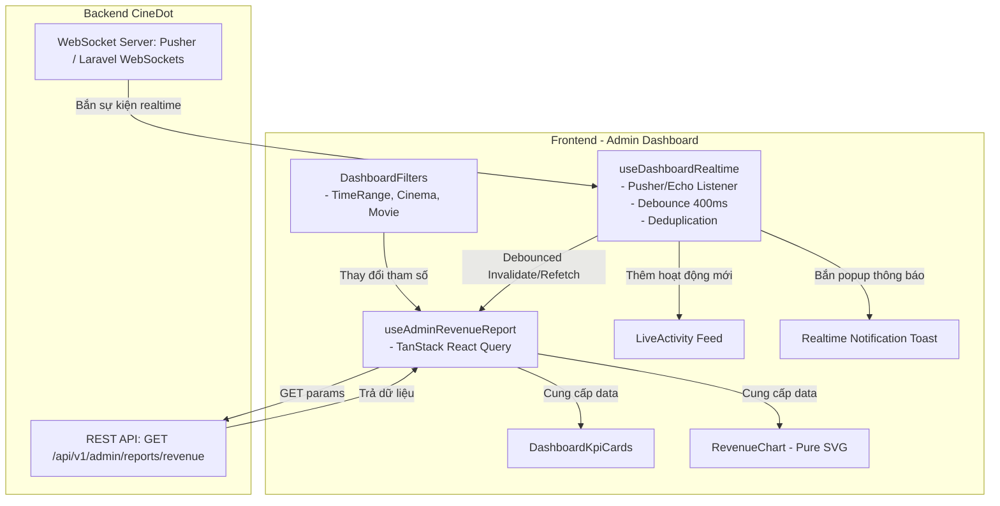

# Tài Liệu Kỹ Thuật: Admin Dashboard (Bảng Điều Hành CineDot)

Tài liệu này tổng hợp toàn bộ kiến trúc, tính năng, luồng dữ liệu và quy chuẩn kỹ thuật đã triển khai tại module **Admin Dashboard** (`/admin/dashboard`) nhằm giúp các thành viên trong đội ngũ phát triển (Frontend, Backend, Tester) nắm bắt nhanh chóng và tiếp tục phát triển/bảo trì.

---

## 1. Tổng Quan Module (Executive Summary)

Module **Admin Dashboard** là trung tâm giám sát & điều hành hoạt động của hệ thống rạp chiếu phim **CineDot**, cung cấp:
- **Thống kê kinh doanh**: Doanh thu, số lượng vé bán, tỷ lệ check-in tại rạp, tỷ lệ tăng trưởng.
- **Biểu đồ trực quan**: Biểu đồ tương tác cao cấp (Interactive SVG Chart) hỗ trợ xem theo Doanh thu hoặc Số vé, tự động làm mịn đường cong và bù đắp các ngày không có giao dịch (*Zero-fill missing dates*).
- **Phân bổ kênh bán lẻ**: Tỷ trọng đặt vé qua Mobile App, Website, và Quầy vé trực tiếp.
- **Giám sát thời gian thực (Realtime)**: Lắng nghe sự kiện qua WebSocket (Pusher / Laravel Echo), cập nhật số liệu ngay lập tức khi phát sinh đơn hàng, thanh toán, hoàn tiền, hủy vé hoặc check-in soát vé tại quầy.

---

## 2. Cấu Trúc File & Mã Nguồn (Architecture & File Structure)

Tất cả mã nguồn liên quan đến Dashboard được tổ chức chuẩn theo Domain-Driven Design trong thư mục `src/modules/admin/`:

```
src/modules/admin/
├── components/
│   ├── AdminDashboardView.tsx          # Component cha điều phối toàn bộ Dashboard
│   └── dashboard/
│       ├── DashboardHeader.tsx         # Tiêu đề, đèn báo trạng thái WebSocket Live, nút làm mới
│       ├── DashboardFilters.tsx        # Thanh lọc đa chiều (Thời gian, Cụm rạp, Phim)
│       ├── DashboardKpiCards.tsx       # 4 thẻ chỉ số KPIs tổng quan + tỷ lệ tăng trưởng
│       ├── RevenueChart.tsx            # Biểu đồ SVG thuần cao cấp, chuyển đổi Doanh thu/Số vé
│       ├── QuickStats.tsx              # Tỷ trọng kênh phân phối vé (App, Web, Counter)
│       └── LiveActivity.tsx            # Bảng dòng sự kiện giao dịch trực tiếp trong phiên
├── hooks/
│   ├── useAdminRevenueReport.ts        # React Query hook lấy dữ liệu báo cáo từ API
│   └── useDashboardRealtime.ts         # Hook kết nối WebSocket, xử lý sự kiện realtime & debounce
├── services/
│   └── adminReport.service.ts          # Service gọi API, chuẩn hóa dữ liệu & tính toán ngày khuyết
├── types/
│   └── adminReport.types.ts            # Type definitions (KPIs, Chart, Filters, Realtime)
└── dto/
    └── adminReport.dto.ts              # Data Transfer Objects từ backend
```

---

## 3. Chi Tiết Các Tính Năng Đã Hoàn Thành

### 3.1. Bộ Lọc Đa Chiều (Multi-Dimensional Filters)
- **File**: `DashboardFilters.tsx` & `adminReport.service.ts`
- **Các tiêu chí lọc**:
  - **Thời gian (Time Range)**:
    - `Hôm nay` (`today`): Từ 00:00 đến 23:59 hôm nay.
    - `7 ngày qua` (`7d`): 7 ngày gần nhất tính tới thời điểm hiện tại.
    - `30 ngày qua` (`30d` - Mặc định): 30 ngày gần nhất.
    - `Tháng này` (`this_month`): Từ ngày 1 của tháng hiện tại đến cuối tháng.
    - `Tháng trước` (`last_month`): Toàn bộ tháng trước.
    - `Tùy chỉnh` (`custom`): Mở 2 ô chọn `startDate` & `endDate` linh hoạt.
  - **Cụm rạp (Cinemas)**: Lấy danh sách rạp động từ API (`useAdminCinemas`), cho phép lọc theo toàn hệ thống hoặc từng cụm rạp cụ thể.
  - **Phim (Movies)**: Lấy danh sách phim động từ API (`useAdminMovies`), lọc báo cáo theo từng tựa phim.
- **Tự động đồng bộ**: Khi chọn bất kỳ mốc thời gian nào, service tự động tính toán chính xác chuỗi `YYYY-MM-DD` gửi lên API.

---

### 3.2. Thẻ Chỉ Số Then Chốt (KPI Cards)
- **File**: `DashboardKpiCards.tsx`
- **4 chỉ số cốt lõi**:
  1. **Tổng Doanh Thu**: Tổng tiền thu được trong kỳ chọn, kèm badge so sánh tăng trưởng (+/- %).
  2. **Tổng Vé Đã Bán**: Tổng số lượng vé phát hành trong kỳ, kèm % tăng trưởng so với kỳ trước.
  3. **Doanh Thu Hôm Nay**: Doanh số phát sinh trong ngày hiện tại.
  4. **Tỷ Lệ Check-In**: Tỷ lệ phần trăm khách đã quét vé vào rạp (`totalCheckedIn / totalBookings`).
- **Trải nghiệm**: Tích hợp Skeleton loading mượt mà khi đang nạp dữ liệu.

---

### 3.3. Biểu Đồ Tương Tác Cao Cấp (Interactive SVG Chart)
- **File**: `RevenueChart.tsx`
- **Điểm nổi bật**:
  - **Thuần SVG (Zero Chart Library Overhead)**: Tự vẽ bằng SVG kết hợp công thức toán nội suy đường cong mượt mà (**Catmull-Rom / Cubic Bézier**) và hiệu ứng gradient đổ bóng hiện đại, giúp bundle size nhẹ và tốc độ render cực nhanh.
  - **Chế độ xem kép (Dual-Metric Toggle)**: Cho phép chuyển đổi tức thì giữa **Doanh thu (₫)** và **Số lượng vé bán (Vé)** mà không cần gọi lại API.
  - **Cơ chế điền ngày khuyết (Zero-fill Missing Dates)**: Hàm `fillMissingDates` trong `adminReport.service.ts` tự động phát hiện và bù đắp các ngày không có giao dịch với giá trị `0`, đảm bảo trục X luôn đầy đủ và không bị đứt gãy mốc thời gian.
  - **Tooltip thông minh**: Khi rê chuột hoặc chạm vào từng điểm mốc trên đồ thị, hiển thị popup nổi chi tiết doanh thu và số vé của ngày đó.

---

### 3.4. Tỷ Trọng Kênh Bán Hàng (Channel Distribution)
- **File**: `QuickStats.tsx`
- Phân tách nguồn thu vé theo 3 kênh:
  - 📱 **Mobile App (iOS / Android)** (Kênh chủ lực)
  - 🌐 **Website (CineDot.vn)**
  - 🏢 **Tại Quầy Rạp (POS / Counter)**
- Hiển thị thanh tiến trình động với animation từ Framer Motion và highlight kênh tăng trưởng mạnh nhất.

---

### 3.5. Hệ Thống Realtime WebSocket & Hoạt Động Trực Tiếp (Live Activity)
- **File**: `useDashboardRealtime.ts` & `LiveActivity.tsx` & `DashboardHeader.tsx`
- **Kênh lắng nghe**: Kênh riêng tư `private-admin.dashboard` qua Laravel Echo & Pusher.
- **Trạng thái kết nối (Connection Indicator)**:
  - 🟢 **Realtime (Connected)**: WebSocket hoạt động bình thường, có hiệu ứng chấm xanh nhấp nháy.
  - 🟡 **Đang kết nối (Connecting)**: Đang thiết lập kết nối tới Pusher.
  - ⚪ **Ngoại tuyến (Disconnected)**: Mất kết nối, hệ thống vẫn duy trì hoạt động qua REST API bình thường.
- **Sự kiện được xử lý**:
  - `payment_completed` / `PAID`: Khách thanh toán đơn đặt vé thành công -> Bắn Toast thông báo xanh + ghi vào Live Activity.
  - `check_in` / `ticket.checked_in` / `ticket.scanned` / `TicketCheckedIn`: Nhân viên vừa quét vé khách vào rạp -> Báo Toast + ghi Live Activity.
  - `refund_completed` / `REFUNDED`: Đơn hàng được hoàn tiền -> Báo Toast cảnh báo vàng.
  - `booking_cancelled` / `CANCELLED`: Đơn bị hủy -> Báo Toast đỏ/info.
  - `revenue.updated`: Sự kiện cập nhật tổng quan.
- **Cơ chế tối ưu & chống nghẽn (Resilience & Performance Guard)**:
  - **Debounced Refetch (400ms)**: Khi có nhiều sự kiện đổ về liên tục trong thời gian ngắn (ví dụ giờ cao điểm mở bán vé), hook chỉ trigger gọi lại API 1 lần sau 400ms ngừng nhận sự kiện, tránh gây sập server/database.
  - **Event Deduplication**: Bộ nhớ đệm tự loại bỏ các sự kiện trùng lặp mã đơn và hành động trong vòng 3 giây.
  - **Auto-dismissing Toast**: Thông báo realtime tự đóng sau 4 giây hoặc có thể đóng thủ công.
  - **Lọc sự kiện theo rạp**: Nếu admin đang lọc xem 1 cụm rạp cụ thể, hook chỉ bắt các sự kiện thuộc cụm rạp đó.

---

## 4. Sơ Đồ Luồng Dữ Liệu (Data Flow Diagram)



---

## 5. Quy Chuẩn API & DTOs Liên Quan

### 5.1. REST API Báo Cáo Doanh Thu
- **Endpoint**: `GET /api/v1/admin/reports/revenue`
- **Query Parameters**:
  | Tham số | Kiểu dữ liệu | Bắt buộc | Mô tả | Ví dụ |
  | :--- | :--- | :--- | :--- | :--- |
  | `start_date` | `string (YYYY-MM-DD)` | Có | Ngày bắt đầu | `2026-07-25` |
  | `end_date` | `string (YYYY-MM-DD)` | Có | Ngày kết thúc | `2026-08-24` |
  | `group_by` | `'day' \| 'week' \| 'month'` | Không | Nhóm dữ liệu theo ngày/tuần/tháng | `day` |
  | `cinema_id` | `number \| string` | Không | ID cụm rạp cần lọc | `1` |
  | `movie_id` | `number \| string` | Không | ID phim cần lọc | `10` |

- **Response Format**:
```json
{
  "status": "success",
  "data": {
    "summary": {
      "total_revenue": 145200000,
      "total_tickets": 1820,
      "today_revenue": 12500000,
      "checkin_rate": 86.4,
      "growth_rate": 14.2,
      "tickets_growth_percent": 9.5,
      "total_bookings": 1820,
      "total_checked_in": 1572
    },
    "chart": [
      { "date": "2026-08-01", "revenue": 4500000, "tickets_sold": 55 },
      { "date": "2026-08-02", "revenue": 5200000, "tickets_sold": 64 }
    ]
  }
}
```

### 5.2. WebSocket Event Format (Kênh `private-admin.dashboard`)
Khi backend phát sinh giao dịch, gửi payload vào event `payment_completed` hoặc `revenue.updated`:
```json
{
  "type": "payment_completed",
  "booking_code": "BK-98231",
  "amount": 180000,
  "customer_name": "Nguyễn Văn A",
  "cinema_id": 1,
  "cinema_name": "CineDot Landmark 81",
  "status": "PAID"
}
```

---

## 6. Hướng Dẫn Dành Cho Developer (Quick Start & Extension)

### 6.1. Cách nhúng Dashboard vào View
Chỉ cần import và render `AdminDashboardView`:
```tsx
import { AdminDashboardView } from '@/modules/admin/components/AdminDashboardView';

export default function AdminDashboardPage() {
  return <AdminDashboardView />;
}
```

### 6.2. Thêm một chỉ số KPI mới
1. Mở file [adminReport.types.ts](file:///d:/hocky6/CineDot/src/modules/admin/types/adminReport.types.ts) -> thêm field vào `RevenueKpis`.
2. Cập nhật mapper trong [adminReport.service.ts](file:///d:/hocky6/CineDot/src/modules/admin/services/adminReport.service.ts).
3. Mở [DashboardKpiCards.tsx](file:///d:/hocky6/CineDot/src/modules/admin/components/dashboard/DashboardKpiCards.tsx) -> thêm item mới vào mảng `cards`.

### 6.3. Thêm một sự kiện Realtime mới
1. Mở [useDashboardRealtime.ts](file:///d:/hocky6/CineDot/src/modules/admin/hooks/useDashboardRealtime.ts).
2. Thêm tên event backend vào mảng `eventNames`.
3. Bổ sung nhánh xử lý trong hàm `handleRevenueUpdated` (cấu hình action name, màu badge và nội dung toast).

---

*Tài liệu được khởi tạo và đồng bộ với phiên bản CineDot Frontend mới nhất.*
