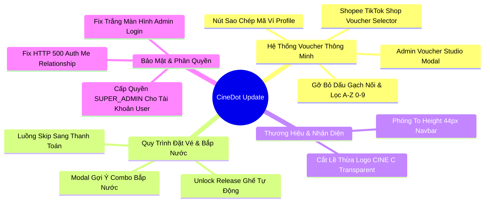

# BÁO CÁO CẬP NHẬT & NÂNG CẤP HỆ THỐNG CINEDOT (FE & BE)

**Dự án:** CineDot - Hệ Thống Đặt Vé Xem Phim & Cửa Hàng Điện Ảnh  
**Ngày báo cáo:** 26/08/2026  
**Người thực hiện:** Antigravity AI Assistant  
**Repository Frontend (FE):** [https://github.com/Charonart/CineDot.git](https://github.com/Charonart/CineDot.git) *(Branch: `feat/ui-showtime-and-auth-gate`)*  
**Repository Backend (BE):** [https://github.com/Charonart/CineDot_BE.git](https://github.com/Charonart/CineDot_BE.git) *(Branch: `feat/api-trailer-and-auth-update`)*  

---

## I. TỔNG QUAN NỘI DUNG CẬP NHẬT

Báo cáo này tổng hợp chi tiết toàn bộ các hạng mục nâng cấp tính năng, cải tiến trải nghiệm người dùng (UX/UI) và sửa lỗi hệ thống trên cả 2 phân hệ Frontend (`CineDot`) và Backend (`CineDot_BE`).



---

## II. CHI TIẾT CÁC HẠNG MỤC CẬP NHẬT DỰ ÁN

### 1. Phân Hệ Voucher Thông Minh (Smart Voucher System)

#### Phía Admin Portal (Cổng Quản Trị)
- **File chỉnh sửa:** [VoucherStudioModal.tsx](file:///c:/DATN/CineDot/src/modules/admin/components/campaigns/VoucherStudioModal.tsx)
- **Nội dung nâng cấp:**
  - **Bộ Sinh Mã Thông Minh (Smart Generator)**: Hỗ trợ sinh mã theo tiền tố thương hiệu (`NEWUSER`, `BDAY`, `VIP`, `SUMMER`, `COMBO`, `CINEDOT`) ghép trực tiếp hậu tố giá trị giảm (VD: `SPECIAL50K`, `NEWUSER50K`, `VIP20PCT`).
  - **Lọc Sạch Mã**: Tự động loại bỏ hoàn toàn dấu gạch nối (`-`), dấu cách, tiếng Việt có dấu và ký tự đặc biệt, chỉ giữ lại ký tự chữ cái viết hoa và chữ số `A-Z, 0-9`.
  - **Thiết Lập Ngày Bắt Đầu Mặc Định**: `validFrom` tự động điền Ngày/Giờ hiện tại (`Local Time`).
  - **Thanh Chọn Nhanh Thời Hạn Hiệu Lực**: Nút chọn nhanh `+7 Ngày`, `+30 Ngày`, `+90 Ngày`, `Hết Tháng Này`.
  - **Tối Ưu Kích Thước Modal**: Thu gọn khung Modal về `max-w-2xl`, `max-h-[90vh]` với thanh cuộn mượt mà, loại bỏ các phần xem trước rườm rà.

#### Phía Khách Hàng (User App Checkout)
- **File tạo mới & chỉnh sửa:** 
  - [UserVoucherSelectorModal.tsx](file:///c:/DATN/CineDot/src/modules/payment/components/UserVoucherSelectorModal.tsx) *(Mới)*
  - [VoucherInputBar.tsx](file:///c:/DATN/CineDot/src/modules/payment/components/VoucherInputBar.tsx)
  - [PaymentClientPage.tsx](file:///c:/DATN/CineDot/src/modules/payment/components/PaymentClientPage.tsx)
  - [PaymentSidebar.tsx](file:///c:/DATN/CineDot/src/modules/payment/components/PaymentSidebar.tsx)
  - [TabRewards.tsx](file:///c:/DATN/CineDot/src/modules/profile/components/TabRewards.tsx)
- **Nội dung nâng cấp:**
  - **Gợi Ý Voucher Chuẩn Shopee / TikTok Shop**: Thêm nút *"Chọn Mã Ưu Đãi Có Sẵn"* mở Modal danh sách Voucher khả dụng.
  - **Phân Loại 2 Nhóm Rõ Ràng**:
    - *Nhóm 1 (Đủ điều kiện)*: Hiện cờ nhãn xanh *"Tiết kiệm XX.XXXđ"* và nút **`[Áp Dụng]`** 1-click.
    - *Nhóm 2 (Chưa đủ đơn tối thiểu)*: Làm mờ nhẹ kèm lý do rõ ràng *"Cần mua thêm XX.XXXđ để dùng mã này"*.
  - **Tính Tiền Tự Động**: Nhấp `[Áp Dụng]` tự động trừ tiền chiết khấu và cập nhật tổng đơn hàng `final_amount` tức thì.
  - **Ví Voucher Profile**: Kết nối API danh sách voucher thực từ DB, bổ sung nút **"Sao Chép Mã"** kèm Toast thông báo.

---

### 2. Quy Trình Đặt Vé Xem Phim & Bắp Nước (Booking Flow Optimization)

- **File tạo mới & chỉnh sửa:**
  - [FoodComboSuggestModal.tsx](file:///c:/DATN/CineDot/src/modules/booking/components/FoodComboSuggestModal.tsx) *(Mới)*
  - [SeatBookingClientPage.tsx](file:///c:/DATN/CineDot/src/modules/booking/components/SeatBookingClientPage.tsx)
  - [SeatGrid.tsx](file:///c:/DATN/CineDot/src/modules/booking/components/SeatGrid.tsx)
  - [useSeatBooking.ts](file:///c:/DATN/CineDot/src/modules/booking/hooks/useSeatBooking.ts)
  - [BookingSidebar.tsx](file:///c:/DATN/CineDot/src/modules/booking/components/BookingSidebar.tsx)
- **Nội dung nâng cấp:**
  - **Bỏ Giữ Ghế Ngay Lập Tức (Unlock Seat Release)**: Khắc phục triệt để sự cố ghế bị khóa giữ khi nhấp chọn/bỏ chọn hoặc quay lại. Ghế được nhả ngay lập tức trên hệ thống realtime.
  - **Sửa Lỗi Ghế Thứ 3 Bị Xám**: Xử lý logic cập nhật mảng state ghế không bị vô hiệu hóa nhầm lẫn khi hủy ghế thứ 3.
  - **Luồng Gợi Ý Combo Thông Minh**:
    - Khi chọn ghế xong bấm *Tiếp Tục*: Hiện Popup gợi ý mua Combo Bắp nước.
    - Nếu khách chọn *Mua Combo* -> Chuyển sang trang Bắp Nước (`/booking/food`).
    - Nếu khách chọn *Bỏ Qua / Skip* -> Chuyển thẳng tới trang Thanh Toán (`/booking/payment`).

---

### 3. Nhận Diện Thương Hiệu & Logo

- **File tạo mới & chỉnh sửa:**
  - [Logo.tsx](file:///c:/DATN/CineDot/src/shared/components/layout/Logo.tsx) *(Mới)*
  - [cinedot-logo.png](file:///c:/DATN/CineDot/public/assets/images/cinedot-logo.png) *(Mới)*
  - [Navbar.tsx](file:///c:/DATN/CineDot/src/shared/components/layout/Navbar.tsx)
  - [Footer.tsx](file:///c:/DATN/CineDot/src/shared/components/layout/Footer.tsx)
- **Nội dung nâng cấp:**
  - **Bóc Tách Lề Thừa & Transparent PNG**: Chạy script bóc tách lề trắng xung quanh logo `CINE C` về khung chuẩn (760x320px) với nền trong suốt 100%.
  - **Phóng To Chuẩn Tỷ Lệ Demo**: Tăng kích thước chiều cao hiển thị từ 34px lên **44px** ở Navbar (và 52px ở Footer), giúp thương hiệu to, nổi bật và đẹp mắt trên thanh kính mờ (Glassmorphism).

---

### 4. Sửa Lỗi Backend, Xác Thực & Phân Quyền Admin

- **File chỉnh sửa Backend (`CineDot_BE`):**
  - [AuthController.php](file:///c:/DATN/CineDot_BE/app/Http/Controllers/Api/AuthController.php)
  - [VoucherController.php](file:///c:/DATN/CineDot_BE/app/Http/Controllers/Api/VoucherController.php)
  - [User.php](file:///c:/DATN/CineDot_BE/app/Models/User.php)
  - [BookingService.php](file:///c:/DATN/CineDot_BE/app/Services/BookingService.php)
  - [UserRoleSeeder.php](file:///c:/DATN/CineDot_BE/database/seeders/UserRoleSeeder.php)
- **File chỉnh sửa Frontend (`CineDot`):**
  - [AdminLayout.tsx](file:///c:/DATN/CineDot/src/modules/admin/components/AdminLayout.tsx)
  - [useAuthStore.ts](file:///c:/DATN/CineDot/src/shared/store/useAuthStore.ts)
- **Nội dung nâng cấp:**
  - **Fix HTTP 500 tại `/api/v1/auth/me`**: Khắc phục lỗi `RelationNotFoundException` do gọi sai relationship `role` trong `AuthController.php`, đổi sang load `userRoles.role` hợp lệ.
  - **Fix Trắng Màn Hình Admin Login**: Đưa điều kiện ưu tiên hiển thị trang `/admin/login` lên đầu tiên trong `AdminLayout.tsx`, đảm bảo Form Đăng nhập nạp ngay 100% không bị ô xám chặn.
  - **Phân Quyền Admin Cho Tài Khoản User**: Gán quyền `SUPER_ADMIN` (`role_id = 1`) cho tài khoản `lequy27102006@gmail.com` (Mật khẩu: `Lequy2710`), hiển thị nút *"Quản Trị Hệ Thống"* nổi bật ở Navbar.

---

## III. DANH SÁCH FILE THAY ĐỔI THEO REPOSITORY

### 1. Frontend Repository (`CineDot`)
| Loại File | Đường Dẫn Tệp | Mô Tả Thay Đổi |
|---|---|---|
| **Modified** | `src/modules/admin/components/campaigns/VoucherStudioModal.tsx` | Nâng cấp Smart Voucher Generator, lọc A-Z0-9, thu gọn modal |
| **Modified** | `src/modules/admin/components/AdminLayout.tsx` | Sửa thứ tự check auth, hiển thị /admin/login tức thì |
| **Modified** | `src/modules/payment/components/VoucherInputBar.tsx` | Thêm nút chọn mã ưu đãi có sẵn |
| **Modified** | `src/modules/payment/components/PaymentClientPage.tsx` | Tích hợp Modal chọn voucher và tính tổng tiền grandTotal |
| **Modified** | `src/modules/payment/components/PaymentSidebar.tsx` | Cập nhật dòng trừ tiền Voucher giảm giá |
| **Modified** | `src/modules/booking/components/SeatBookingClientPage.tsx` | Sửa luồng chuyển bước Skip Bắp Nước sang Thanh Toán |
| **Modified** | `src/modules/booking/components/SeatGrid.tsx` | Sửa logic nhả ghế tạm thời & ghế thứ 3 xám |
| **Modified** | `src/shared/components/layout/Navbar.tsx` | Phóng to Logo 44px, hiển thị nút Quản Trị |
| **Modified** | `src/shared/components/layout/Footer.tsx` | Phóng to Logo 52px ở Footer |
| **Modified** | `src/shared/store/useAuthStore.ts` | Thêm kiểm tra vai trò Admin cho hasPermission |
| **Untracked (New)** | `src/modules/payment/components/UserVoucherSelectorModal.tsx` | Modal gợi ý Voucher chuẩn Shopee / TikTok Shop |
| **Untracked (New)** | `src/modules/booking/components/FoodComboSuggestModal.tsx` | Popup gợi ý mua Bắp Nước sau khi chọn ghế |
| **Untracked (New)** | `src/shared/components/layout/Logo.tsx` | Component Logo chuẩn hệ thống |
| **Untracked (New)** | `public/assets/images/cinedot-logo.png` | Ảnh logo CINE C nền trong suốt transparent |

### 2. Backend Repository (`CineDot_BE`)
| Loại File | Đường Dẫn Tệp | Mô Tả Thay Đổi |
|---|---|---|
| **Modified** | `app/Http/Controllers/Api/AuthController.php` | Sửa lỗi 500 load('userRoles.role') |
| **Modified** | `app/Http/Controllers/Api/VoucherController.php` | Cập nhật listActive API trả về title & category |
| **Modified** | `app/Models/User.php` | Cập nhật Accessor getRoleAttribute |
| **Modified** | `app/Services/BookingService.php` | Tự động tăng used_count khi thanh toán thành công |
| **Modified** | `database/seeders/UserRoleSeeder.php` | Gán SUPER_ADMIN cho lequy27102006@gmail.com |

---

## IV. QUY TRÌNH THỰC THI PUSH CODE LÊN GITHUB

```bash
# ==========================================
# BƯỚC 1: PUSH REPOSITORY FRONTEND (CineDot)
# Repo: https://github.com/Charonart/CineDot.git
# Branch: feat/ui-showtime-and-auth-gate
# ==========================================
cd c:\DATN\CineDot
git add .
git commit -m "feat(voucher): upgrade smart voucher studio, Shopee-style selector modal and logo branding"
git push origin feat/ui-showtime-and-auth-gate

# ==========================================
# BƯỚC 2: PUSH REPOSITORY BACKEND (CineDot_BE)
# Repo: https://github.com/Charonart/CineDot_BE.git
# Branch: feat/api-trailer-and-auth-update
# ==========================================
cd c:\DATN\CineDot_BE
git add .
git commit -m "fix(auth): resolve 500 error on /auth/me relationship, update admin roles and voucher APIs"
git push origin feat/api-trailer-and-auth-update
```

---

*Báo cáo được khởi tạo tự động bởi Antigravity AI System.*
