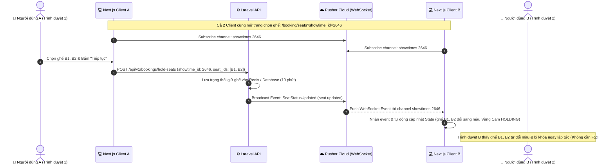

# 📡 Hướng Dẫn Kiểm Thử & Cấu Hình WebSocket Realtime (Pusher)

Tài liệu này hướng dẫn chi tiết cách cấu hình, vận hành và kiểm thử tính năng **Đồng bộ trạng thái ghế theo thời gian thực (Realtime Seat Booking)** giữa Backend (Laravel) và Frontend (Next.js) thông qua dịch vụ **Pusher Channels WebSocket**.

---

## 1. 🏗️ Tổng Quan Kiến Trúc (Architecture Overview)



---

## 2. ⚙️ Cấu Hình Môi Trường (Environment Variables)

### 🔹 Backend (`CineDot_BE/.env`)
```dotenv
# Cấu hình Driver phát sóng
BROADCAST_CONNECTION=pusher
# (Nếu dùng phiên bản Laravel 10 trở xuống thì dùng BROADCAST_DRIVER=pusher)

# Thông tin xác thực Pusher App
PUSHER_APP_ID=2188184
PUSHER_APP_KEY=2749e24d6fa468eeb986
PUSHER_APP_SECRET=3379dac8c49998285fa8
PUSHER_APP_CLUSTER=mt1

# Thời gian giữ ghế tạm thời (mặc định 600 giây = 10 phút)
HOLD_SEAT_EXPIRE_SECONDS=600
```

> **Lưu ý Backend:** Sau khi sửa `.env`, luôn chạy lệnh xóa cache cấu hình:
> ```bash
> php artisan config:clear
> ```

---

### 🔹 Frontend (`CineDot/.env.local` hoặc `.env`)
```dotenv
NEXT_PUBLIC_API_BASE_URL=http://127.0.0.1:8000/api/v1
NEXT_PUBLIC_IMAGE_BASE_URL=http://127.0.0.1:8000

# Pusher Channels Config
NEXT_PUBLIC_PUSHER_APP_KEY=2749e24d6fa468eeb986
NEXT_PUBLIC_PUSHER_APP_CLUSTER=mt1
NEXT_PUBLIC_PUSHER_SCHEME=https
```

> **Lưu ý Frontend:** Sau khi sửa biến môi trường có tiền tố `NEXT_PUBLIC_`, cần **khởi động lại Next.js dev server**:
> ```bash
> npm run dev
> ```

---

## 3. 📋 Đặc Tả Kênh & Sự Kiện (Channels & Events Specification)

| Thuộc tính | Giá trị | Mô tả |
| :--- | :--- | :--- |
| **Channel Name** | `showtimes.{showtime_id}` | Kênh Public theo mã suất chiếu (Ví dụ: `showtimes.2646`) |
| **Event Name** | `seat.updated` | Tên sự kiện phát sóng từ Laravel |
| **Event Class** | `App\Events\SeatStatusUpdated` | Implements `ShouldBroadcastNow` |
| **Transports** | `['ws', 'wss']` | Kết nối WebSocket an toàn qua cổng 443 |

### 📦 Cấu trúc Payload JSON gửi qua WebSocket:
```json
{
  "showtime_id": 2646,
  "seat_ids": [101, 102, 103],
  "status": "holding",
  "user_id": 1,
  "updated_at": "2026-08-22T12:00:00+07:00"
}
```

### 🏷️ Bảng Quy Ước Trạng Thái Ghế (`status`):
* `holding`: Ghế đang có người giữ (Hiển thị **Màu Vàng Cam** 🟨).
* `booked`: Ghế đã thanh toán / đặt thành công (Hiển thị **Màu Xám Khóa** 🔒).
* `available`: Ghế được trả về trạng thái trống (Hiển thị **Màu Mặc Định** ⬜).
* `blocked`: Ghế bị khóa kỹ thuật bảo trì (Không thể chọn ⛔).

---

## 4. 🧪 Hướng Dẫn Các Cách Kiểm Thử (Testing Guide)

---

### 👉 CÁCH 1: Kiểm thử thực tế giữa 2 trình duyệt (Khuyến Nghị)

Đây là quy trình kiểm tra giống 100% trải nghiệm thực tế của người dùng:

1. **Chuẩn bị 2 trình duyệt độc lập:**
   * Mở trình duyệt 1: **Google Chrome**
   * Mở trình duyệt 2: **Cốc Cốc** (hoặc Microsoft Edge / Tab Ẩn danh).
2. **Cùng truy cập vào CHÍNH XÁC 1 link suất chiếu:**
   ```text
   http://localhost:3000/booking/seats?showtime_id=2646
   ```
3. **Bật Console kiểm tra kết nối:**
   * Nhấn phím `F12` -> Chọn tab **Console** trên cả 2 trình duyệt.
   * Xác nhận thấy log:
     ```text
     Pusher : State changed : connecting -> connected
     Pusher : Subscribed to channel : showtimes.2646
     ```
4. **Thực hiện thao tác:**
   * Trên **Trình duyệt 1 (Cốc Cốc)**: Nhấp chọn ghế `B1, B2` 👉 Bấm nút **"Tiếp tục"** ở cột bên phải.
5. **Quan sát kết quả trên Trình duyệt 2 (Google Chrome):**
   * Ghế `B1, B2` trên màn hình Google Chrome sẽ **tự động chuyển sang màu Vàng Cam (`HOLDING`)** ngay lập tức mà **KHÔNG CẦN F5**.
   * Trên F12 Console của Google Chrome xuất hiện dòng log:
     ```text
     📡 [Pusher Realtime Event] { showtime_id: 2646, seat_ids: [...], status: "holding" }
     ```

---

### 👉 CÁCH 2: Kiểm thử trực tiếp từ Laravel Tinker

Dùng cách này để kiểm tra xem Backend Laravel có gửi được tín hiệu lên Pusher Cloud hay không mà không cần qua giao diện web:

1. Mở terminal tại thư mục Backend **`CineDot_BE`**:
   ```bash
   php artisan tinker
   ```
2. Gõ lệnh phát event thử nghiệm:
   ```php
   event(new \App\Events\SeatStatusUpdated(2646, [1, 2, 3], 'holding', 999));
   ```
3. Xem trên tab trình duyệt đang mở suất chiếu `2646`, các ghế ID 1, 2, 3 sẽ lập tức đổi màu vàng cam!

---

### 👉 CÁCH 3: Kiểm thử qua Pusher Dashboard (Debug Console)

1. Đăng nhập vào trang quản trị [Pusher Dashboard](https://dashboard.pusher.com).
2. Chọn App của bạn -> Vào menu **Debug Console** ở thanh bên trái.
3. Nhìn vào mục **Event Creator** (góc trên bên phải):
   * **Channel:** `showtimes.2646`
   * **Event:** `seat.updated`
   * **Data:**
     ```json
     {
       "showtime_id": 2646,
       "seat_ids": [10, 11],
       "status": "holding"
     }
     ```
4. Bấm **Send event** 👉 Màn hình web của bạn sẽ tự đổi màu ghế tương ứng ngay lập tức.

---

## 5. 🔍 Xử Lý Sự Cố Thường Gặp (Troubleshooting & FAQs)

| Triệu chứng | Nguyên nhân khả dĩ | Cách khắc phục |
| :--- | :--- | :--- |
| **Chọn ghế bên A nhưng bên B không đổi màu** | 2 trình duyệt đang mở **2 mã `showtime_id` khác nhau** (ví dụ 2638 vs 2646). | Đảm bảo cả 2 tab cùng chung 1 tham số `showtime_id` trên thanh địa chỉ URL. |
| **Bên A bấm "Tiếp tục" nhưng Debug Console của Pusher không có Event** | Event trong Laravel dùng `ShouldBroadcast` nhưng chưa chạy hàng đợi queue, hoặc Controller chưa gọi `event(...)`. | 1. Đổi Event sang `implements ShouldBroadcastNow`.<br>2. Kiểm tra Controller đã có dòng `event(new SeatStatusUpdated(...))`. |
| **F12 Console báo lỗi WebSocket connection failed / 401** | Sai Pusher Key hoặc Cluster trong file `.env.local`. | Kiểm tra lại `NEXT_PUBLIC_PUSHER_APP_KEY` và `NEXT_PUBLIC_PUSHER_APP_CLUSTER=mt1`, sau đó restart Next.js server (`npm run dev`). |
| **Ghế bị chọn trùng nhưng giao diện chưa cập nhật** | Bộ nhớ cache trình duyệt chưa nạp code mới. | Nhấn `Ctrl + F5` trên trình duyệt để xóa cache JS. |
